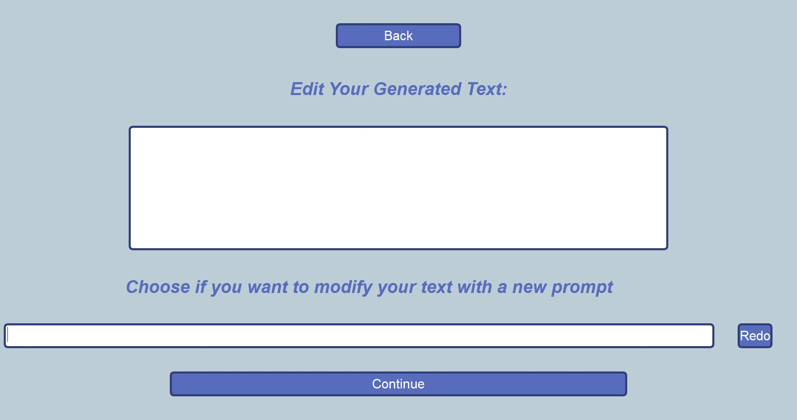
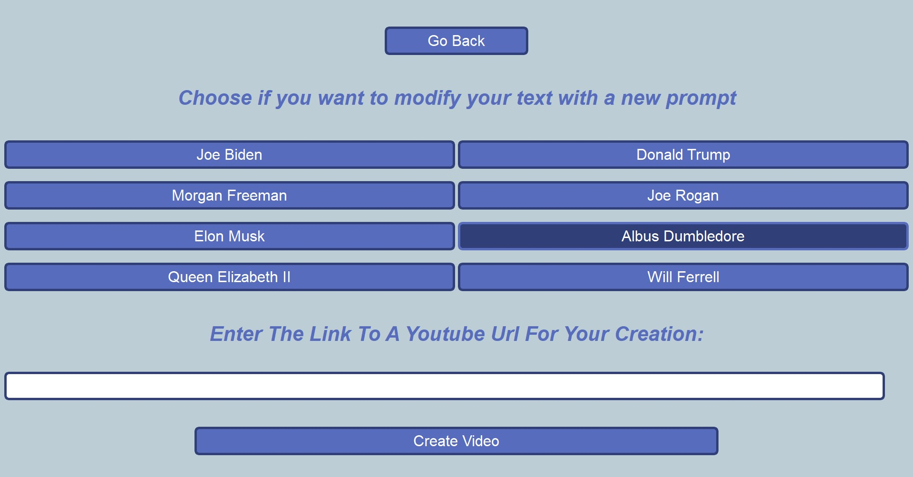
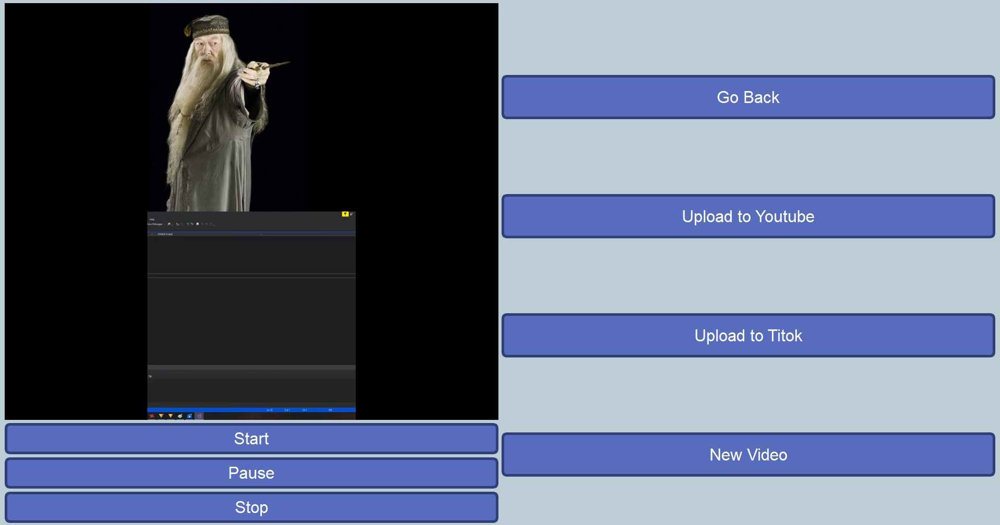

<h3 align="center">
  <br>

  Group Awesome presents

</h3>

<h1 align="center">
  𝙍𝘼𝘾𝙀𝙍
  <br><br>
  <a href="https://github.com/AndresLopezBormann/HackKu2023"></a>
  <br><br>
  R-eddit
  <br>
  A-nd
  <br>
  C-hatGPT with
  <br>
  E-levenLabs
  <br>
  R-ecitation
  <br><br>
</h1>

<h4 align="center">A content creation tool used for speedy automated video making.</h4>


<p align="center">
  <a href="#key-features">Key Features</a> •
  <a href="#how-to-use">How To Use</a> •
  <a href="#download">Download</a> •
  <a href="#license">License</a>
</p>
<br>
<div align="center">
</a>
</a><br>
</a>
</a><br>
</div>
<br>

## Key Features

* Reddit Getter - Use any Reddit post as material for your post
  - Instantly retrieves the Reddit post from a url
* ChatGPT Prompting - Use any prompt to modify the Reddit post before creating the video
  - Updates the Reddit post to modify text
* ElevenLabs Voice Selector - Use a selection of voices to add characters to the
  - Updates the Reddit post to modify text
* Youtube Video Getter for Backgrounds - Use any Youtube post as a background video for your creation
  - Instantly retrieves and sets the youtube video as the background on your creation 
<br>

## How To Use

To clone and run this application, you'll need [Git](https://git-scm.com) and [Python](https://www.python.org/)  installed on your computer. From your command line:

```bash
# Clone this repository
$ git clone https://github.com/AndresLopezBormann/HackKu2023

# Go into the repository
$ cd HackKu2023

# Install python libraries
$ pip install -r requirements.txt

# Run the app
$ python mainGUI.py
```

## Download

You can [download](https://github.com/AndresLopezBormann/HackKu2023) the latest installable version of Racer for Windows, macOS and Linux.
<br>

## Video Creation software app

Racer is a [Video creation software app](https://en.wikipedia.org/wiki/Video_editing_software). If you liked or disliked using this app, let me know! Send us an email at <Alopezb1@ku.edu>, <BenCLottes@ku.edu>, <A008P058@ku.edu>, or <AlexisGray23@ku.edu> about anything you'd want to say about this software. We'd really appreciate it!

<br>

## You may also like...

- [Reddit](https://www.reddit.com/) - Reddit
- [ChatGPT](https://openai.com/blog/chatgpt) - ChatGPT
- [ElevenLabs](https://beta.elevenlabs.io/speech-synthesis) - ElevenLabs


## License

MIT

---
